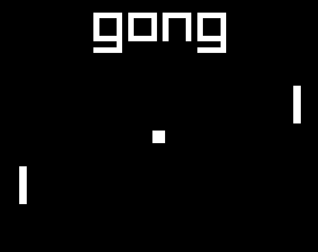

# gong

Pong, but in `go`. Therefore, `gong`.




## But why?

I wanted to learn some `go`, use the `raylib` library and start from scratch on coding games.


## Compile, Run

You will probably need `go` version `1.18` to make it run, not sure how `*.mod` files actually work.

```sh
# Simply run this
go run main.go
# To create a binary file
go build main.go
```

## Credits

Sound effects generated with `SFXIA`: https://rxi.itch.io/sfxia
